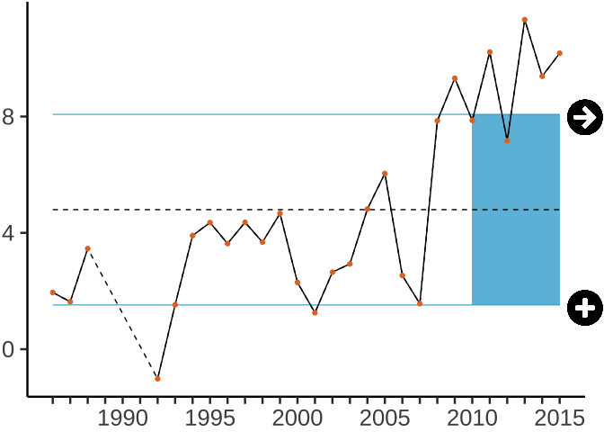

ecoidx
================

<!-- README.md is generated from README.Rmd. Please edit that file -->

This R package consists of a set of helper datasets and plotting
functions for developing and communicating marine ecological indicators,
particularly for NOAA’s Integrated Ecological Assessment program in the
California Current.

## Load the R package

This package lives on Github, not yet CRAN, so you’ll need to run the
following once:

``` r
remotes::install_github("marinebon/ecoidx")
```

Then to load the package when using:

``` r
library(ecoidx)
```

## Datasets

Most datasets were loaded from [ERDDAP searching
“cciea”](https://oceanview.pfeg.noaa.gov/erddap/search/index.html?page=1&itemsPerPage=1000&searchFor=cciea).

You can see the available datasets for this package from the R Console
with:

``` r
data(package = "ecoidx")
```

Or look at the
[Reference](./reference/index.html#section-datasets-erddap).

The ERDDAP datasets are “evergreen” and preferred. These are loaded for
convenience, especially for quickly trying out the data wrangling and
plotting functions.

## Plot

Here’s an example of using the `plot_ts()` function, starting with an
example timeseries dataset `ts1`.

``` r
# example time series dataset with some NAs to show dashed line between non-NA values
head(ts1, 8)
```

<div class="kable-table">

| year |      index |         Y2 |       SElo |     SEup | timeseries                | metric | type         |
| ---: | ---------: | ---------: | ---------: | -------: | :------------------------ | :----- | :----------- |
| 1986 |   1.951787 |   1.951787 | \-0.048213 | 3.951787 | (a) Trend and recent mean | NA     | current.data |
| 1987 |   1.631605 |   1.631605 | \-0.368395 | 3.631605 | (a) Trend and recent mean | NA     | current.data |
| 1988 |   3.457652 |   3.457652 |   1.457652 | 5.457652 | (a) Trend and recent mean | NA     | current.data |
| 1989 |         NA |         NA |         NA |       NA | (a) Trend and recent mean | NA     | current.data |
| 1990 |         NA |         NA |         NA |       NA | (a) Trend and recent mean | NA     | current.data |
| 1991 |         NA |         NA |         NA |       NA | (a) Trend and recent mean | NA     | current.data |
| 1992 | \-1.016788 | \-1.016788 | \-3.016788 | 0.983212 | (a) Trend and recent mean | NA     | current.data |
| 1993 |   1.526880 |   1.526880 | \-0.473120 | 3.526880 | (a) Trend and recent mean | NA     | current.data |

</div>

``` r

# defaults to include all options
g <- plot_ts(ts1)
g
```

<!-- -->

``` r

# show the caption attributed to the returned ggplot object
cat(attr(g, "caption"))
#>  The index changed by less than one standard deviation of the full time series over the last 5 years (indicated by icon: →).   The mean of the last 5 years was more than one standard deviation below the mean of the full time series (indicated by icon: +).

# without SElo or SEhi columns, just year and index
g <- plot_ts(ts1[,c("year","index")])
g
```

<!-- -->

``` r

# same caption as previously, since defaults to x_recent=5 and add_avg=T
cat(attr(g, "caption"))
#>  The index changed by less than one standard deviation of the full time series over the last 5 years (indicated by icon: →).   The mean of the last 5 years was more than one standard deviation below the mean of the full time series (indicated by icon: +).

# without default x_recent, add_avg, or add_icons
g <- plot_ts(ts1, x_recent=NA, add_icons=F, add_avg=F)
g
```

<!-- -->

``` r

# no caption, since missing x_recent and add_avg
cat(attr(g, "caption")) # empty caption without x_recent
```

## Developer

This section is only meant for developers wishing to contribute or
understand how this R package and website were built using `devtools`,
`usethis` and `pkgdown` R packages.

### One time

Setup Github Actions to update documentation upon `git push` into
`gh-pages` branch:

``` r
usethis::use_github_action("pkgdown")
```

Modified the
[.github/workflows/pkgdown.yaml](https://github.com/marinebon/ecoidx/blame/5b1b44104029fbc167146b9037b0030db390f774/.github/workflows/pkgdown.yaml#L38-L50)
with 3 extra lines to fully document the package from source:

``` yaml
    - name: Install dependencies
      ...
          install.packages("devtools", type = "binary")
    - name: Deploy package
      ...
          Rscript -e 'devtools::document()'
          Rscript -e 'rmarkdown::render("README.Rmd")'
```

### Load dataset

1.  Place into CSV into `data-raw/` folder
2.  Create dataset. Create `get_[dataset].R` script to read, potentially
    wrangle and then load into R package as a dataset using
    `usethis::use_data()`. Run `get_[dataset].R` to generate
    `data/[dataset].rda`.
3.  Document dataset. Create `R/[dataset].R`. Run `devtools::document()`
    to create `man/[dataset].Rd`.
4.  Document package. Run `pkgdown::build_reference()` to update
    `docs/reference/index.html`.

### Develop functions

To import a library:

``` r
usethis::use_package("dplyr")
usethis::use_package("ggplot2")
```

After updating documentation:

``` r
devtools::document()
pkgdown::build_reference()
```
